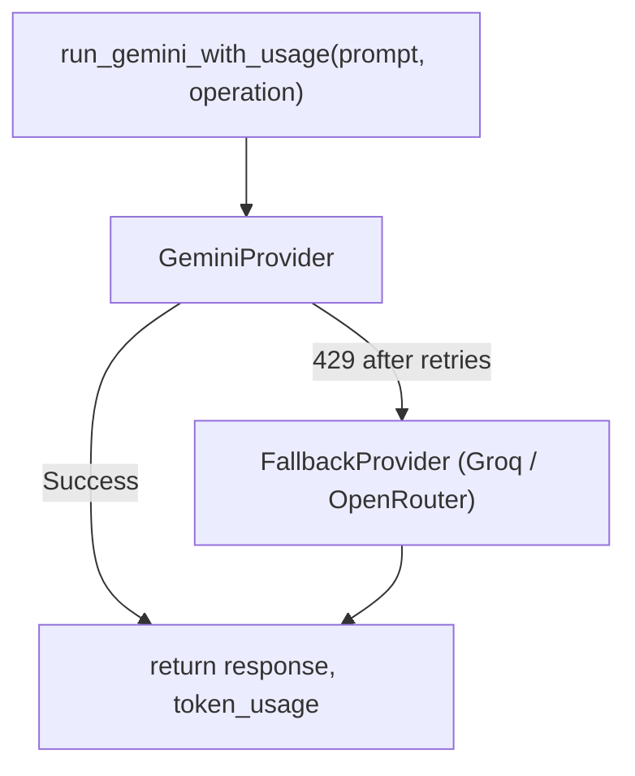

# Gemini Rate Limit: Assessment & Solutions

## The Problem (Quantified)

Google cut free-tier quotas **50–80% in December 2025**. Current limits as of April 2026:


| Model                              | RPM | RPD   |
| ---------------------------------- | --- | ----- |
| Gemini 2.5 Flash (current default) | 10  | 250   |
| Gemini 2.5 Flash-Lite              | 15  | 1,000 |
| Gemini 2.5 Pro                     | 5   | 100   |


A typical D.fuse session (upload CSV → ask 3 explore questions → use agent 3×) consumes roughly **15–20 API calls**. At 250 RPD that is only **12–16 full sessions per day** before hitting the wall.

The two highest-frequency operations are:

- `Code Generation` + `Result Refinement` — one pair per AI Explore query (most-used feature)
- `Agent Actions` — one call per agent message in the Smart Agent panel

There is **no retry logic, no backoff, and no request caching** currently in the backend. A 429 is simply surfaced as an error message.

---

## Solution Options (Ranked by Effort vs. Impact)

### Option A — Switch Default to Gemini Flash-Lite (Effort: Minimal, Impact: 4×)

**Flash-Lite** has **1,000 RPD** (4× more than Flash) at the cost of slightly reduced output quality. It is already in the model dropdown. The only change needed is to flip the default in `ConfigContext.jsx` and ensure the backend and model picker label it as the default.

- `frontend/src/contexts/ConfigContext.jsx` line 9: change default from `gemini-2.5-flash` to `gemini-2.5-flash-lite`
- `frontend/src/pages/SettingsPage.jsx`: update the SelectItem label to mark Flash-Lite as the recommended choice

**Trade-off:** Flash-Lite produces slightly less accurate pandas code for complex queries. For simple explore and agent tasks it performs comparably.

---

### Option B — Add Retry with Exponential Backoff (Effort: Small, Impact: High)

Currently a 429 instantly fails the request. Adding a retry loop in `run_gemini_with_usage()` in `backend/gemini_llm.py` means transient rate limit spikes are recovered automatically.

Pattern (using `tenacity` or manual loop):

```python
import time

MAX_RETRIES = 3
RETRY_DELAYS = [5, 15, 30]  # seconds

for attempt, delay in enumerate(RETRY_DELAYS):
    try:
        response = self.model.generate_content(prompt)
        break
    except Exception as e:
        if "429" in str(e) and attempt < MAX_RETRIES - 1:
            time.sleep(delay)
        else:
            raise
```

- Add `tenacity` or use manual loop in `backend/gemini_llm.py` `run_gemini_with_usage()`
- Add `tenacity` to `backend/requirements.txt`
- Surface retry status in the frontend (e.g. "Rate limited, retrying in 15s…") via the existing error message flow

---

### Option C — Add a Secondary Provider as Fallback (Effort: Medium, Impact: Very High)

When Gemini returns 429, the system falls back to an alternative provider. Two strong candidates:

**Groq (recommended fallback)**

- Free tier: 30 RPM, ~14,400 RPD on Llama 3.1 8B; 6,000 RPD on Llama 3.3 70B
- OpenAI-compatible API (`https://api.groq.com/openai/v1`)
- Python SDK: `pip install groq`
- Strengths: fastest inference available, excellent code generation on Llama 3.3 70B
- Best fit for: `Code Generation`, `Result Refinement`, `Agent Actions` — the high-frequency calls
- Weakness: no Gemini-native function calling; JSON structured outputs need prompt engineering

**OpenRouter (flexible aggregator)**

- Aggregates 300+ models; `openrouter/free` router auto-selects available free models
- Also OpenAI-compatible (`https://openrouter.ai/api/v1`)
- Python SDK: `pip install openrouter` (or just use `openai` SDK with base URL override)
- Strength: single API key covers 30+ free models, automatic failover across providers
- Weakness: free model availability is not guaranteed; no SLA; quality varies

**Infrastructure change — Provider Abstraction Layer**

This requires introducing a `BaseLLMProvider` abstraction in `gemini_llm.py` (or a new `llm_router.py`) so that `run_gemini_with_usage()` can delegate to a secondary provider on 429:




Files to change:

- `backend/gemini_llm.py` — add `_call_with_fallback()` wrapper around `generate_content`
- `backend/requirements.txt` — add `groq` or `openai` (for OpenRouter compatibility)
- `frontend/src/pages/SettingsPage.jsx` and `frontend/src/contexts/ConfigContext.jsx` — add optional fallback API key field (Groq key or OpenRouter key)
- `backend/app.py` — pass the fallback key through to `GeminiDataFormulator`

---

### Option D — Session-Level Response Caching (Effort: Medium, Impact: Moderate)

Many users re-ask similar questions or re-trigger chart creation on the same dataset. Caching identical prompts within a session avoids re-hitting the API.

The existing `CHART_INSIGHTS_CACHE` dict in `app.py` (line 69) already demonstrates the pattern. This can be extended:

- Add an LRU cache in `GeminiDataFormulator` keyed by `hash(prompt)` with TTL or max size
- Persist it as a module-level dict in `gemini_llm.py` (not instance-level, since instances are created per-request)
- Scope: only cache deterministic operations — `Chart Insights`, `Transformation Plan`, `Metric Calculation`
- Do NOT cache `Code Generation` or `Agent Actions` (user-specific, stateful)

---

### Option E — Multiple API Key Rotation (Effort: Small, Impact: Moderate)

Each Google Cloud project has separate quotas. A user can create 2–3 Gemini API keys from different Google accounts. The backend rotates through them on 429.

- Add a `fallback_api_keys: list[str]` field to request models in `app.py`
- `GeminiDataFormulator` tries keys in round-robin order
- Frontend: add an optional "Backup API Keys" section in the settings panel (comma-separated)

---

## All AI Tasks — Sequence of Operations with Model Recommendations

Every call that hits `run_gemini_with_usage()` in the backend, listed in the order a typical session triggers them:


| #   | Operation               | Triggered By                            | Frequency       | Complexity  | Recommended Model |
| --- | ----------------------- | --------------------------------------- | --------------- | ----------- | ----------------- |
| 1   | Config Test             | Settings → Test Config button           | One-time        | Trivial     | Flash Lite        |
| 2   | Dataset Analysis        | File upload (CSV/Excel)                 | Low (on upload) | Medium      | Flash Lite        |
| 3   | Relationship Enrichment | Multi-table join detection              | Low             | Medium      | Flash Lite        |
| 4   | Chart Suggestions       | AI Explore sidebar load                 | Low             | Low         | Flash Lite        |
| 5   | Query Planning          | AI Explore query (2-call path)          | High            | Medium      | Flash Lite        |
| 6   | Plan & Generate         | AI Explore query (1-call fast path)     | High            | **High**    | **Flash**         |
| 7   | Code Generation         | AI Explore query (2-call path, step 2)  | High            | **High**    | **Flash**         |
| 8   | Unified Analysis        | AI Explore with multi-source data       | Medium          | **High**    | **Flash**         |
| 9   | Smart Single Chart      | Direct chart creation from AI           | Medium          | Medium-High | **Flash**         |
| 10  | Result Refinement       | After code execution — answer synthesis | High            | Medium      | Flash Lite        |
| 11  | Metric Calculation      | KPI / metric tile queries               | Medium          | Medium      | Flash Lite        |
| 12  | Chart Insights          | Chart node → "Explain this chart"       | Medium          | Low         | Flash Lite        |
| 13  | Transformation Plan     | Data transform modal                    | Low             | Medium      | Flash Lite        |
| 14  | AI-Assisted Fusion      | Multi-dataset join/merge flow           | Low             | Medium      | Flash Lite        |
| 15  | Batch Analysis          | Bulk dataset processing                 | Low             | Medium      | Flash Lite        |
| 16  | Agent Actions           | Smart Agent panel — each user turn      | High            | **High**    | **Flash**         |


**Frequency key:** High = multiple times per session, Medium = once per session, Low = occasional

---

## Summary by Model Tier

### Use Full `gemini-2.5-flash` for (5 operations)

These involve code generation, structured multi-step reasoning, or agent planning where output errors are silent and costly:

- **Plan & Generate** — combines table selection + pandas code in one call; wrong output silently produces bad charts
- **Code Generation** — pandas code that runs in a sandboxed exec(); silent errors surface as empty results
- **Unified Analysis** — synthesises insights across multiple joined datasets; quality matters for accuracy
- **Smart Single Chart** — end-to-end chart spec + code in one shot; Flash Lite tends to miss edge-case chart configs
- **Agent Actions** — multi-step tool-call planning for the Smart Agent; Flash Lite can mis-sequence or drop steps

### Use `gemini-2.5-flash-lite` for (11 operations)

These are lower-stakes, shorter-output, or easily-validated calls where slight quality reduction is acceptable:

- Config Test, Dataset Analysis, Relationship Enrichment, Chart Suggestions
- Query Planning (table selection only — no code generated)
- Result Refinement (natural language summary of already-executed results)
- Metric Calculation, Chart Insights, Transformation Plan, AI-Assisted Fusion, Batch Analysis

**Net effect of tiering:** roughly **70% of calls** can run on Flash Lite (1,000 RPD), reserving Flash (250 RPD) for the critical 30%. This effectively stretches daily quota by ~3×.

---

## Key Implementation Notes from This Thread

- The Settings page the user sees is `**frontend/src/pages/SettingsPage.jsx`**, not `App.jsx`. Both files contain a model dropdown but only `SettingsPage.jsx` is rendered at `/settings`. Any model list changes must be applied to **both files** to keep the canvas-level settings panel in sync.
- `gemini-2.5-flash-lite` has been added to both `SettingsPage.jsx` and `App.jsx` dropdowns, and to the backend model mapper in `gemini_llm.py`. Users can now select it from the UI.
- The default in `frontend/src/contexts/ConfigContext.jsx` is still `gemini-2.5-flash`. Switching the default to `gemini-2.5-flash-lite` (Option A) is a one-line change with the largest RPD impact.
- Automatic model routing (Flash vs. Flash Lite per operation) is a backend-only change — the `operation` parameter is already passed to `run_gemini_with_usage()` everywhere, so a routing dict keyed by operation name is all that is needed.

---

## Recommended Implementation Order

- **Immediate (no breaking changes):**
  - Option A — change default model to Flash-Lite in `ConfigContext.jsx` (1 line change, 4× daily quota)
  - Option B — add retry/backoff in `run_gemini_with_usage()` (handles burst spikes)
- **Short-term (requires user to supply a second API key):**
  - Option C with Groq — add `groq` to `requirements.txt`, add `_call_with_fallback()` in `gemini_llm.py`, add Groq API key field in Settings
- **Optional enhancements:**
  - Option D — prompt caching for repeated deterministic calls
  - Option E — multiple Gemini key rotation for power users

---

## What Will NOT Work

- **OpenAI**: free tier is 3 RPM on GPT-3.5 only — worse than Gemini
- **Anthropic Claude**: no permanent free tier; trial credits only
- **Gemini 2.5 Pro**: 100 RPD on free tier — worse than Flash, much worse than Flash-Lite
- Creating multiple API keys in the same Google project: quotas are per-project, not per-key

---

## Files Involved


| File                                      | Change                                                                                      |
| ----------------------------------------- | ------------------------------------------------------------------------------------------- |
| `backend/gemini_llm.py`                   | Retry loop in `run_gemini_with_usage()`; optional fallback provider `_call_with_fallback()` |
| `backend/requirements.txt`                | Add `tenacity` and/or `groq`                                                                |
| `backend/app.py`                          | Pass `fallback_api_key` / `fallback_model` through request models                           |
| `frontend/src/contexts/ConfigContext.jsx` | Change default model; add fallback key state                                                |
| `frontend/src/pages/SettingsPage.jsx`     | Update model labels; add optional fallback provider key input                               |


